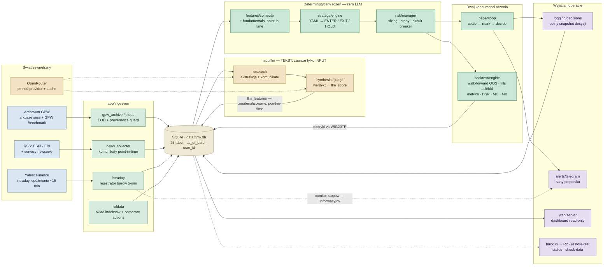

# Mapa repozytorium

Wizualny przewodnik po całym repozytorium: co skąd przychodzi, co jest liczone
deterministycznie i którędy dane wychodzą do użytkownika. Diagramy renderują się
bezpośrednio na GitHubie (Mermaid), w motywie jasnym i ciemnym.

**W liczbach:** 49 plików `.py` · ~10,2 tys. linii w `app/` · 359 testów w 37
plikach · 25 tabel SQLite · 11 configów YAML · benchmark **WIG20TR**.

**Zasady nienaruszalne** (pilnowane testami, szczegóły w [CLAUDE.md](../CLAUDE.md)):
pieniądze = kod deterministyczny (zero LLM w ścieżce finansowej) ·
point-in-time (`as_of_date` na każdym wierszu) · anty-survivorship ·
realistyczne koszty + walk-forward OOS · wyłącznie paper trading.

## Architektura przepływu danych

Od źródeł zewnętrznych, przez ingestion i bazę, po sygnały, ryzyko i wyjścia.
Linie przerywane to ścieżki pomocnicze (audyt, monitoring, odczyt).



Kolory: niebieski = źródła danych · zielony jasny = ingestion · piaskowy = baza ·
bursztynowy = warstwa LLM (tekst) · zielony ciemny = deterministyczny rdzeń ·
fioletowy = wyjścia i operacje.

## Wieczorny cykl `make signals`

Cron o 19:30 w dni robocze, po publikacji wyników sesji. Cechy LLM są czytane z
gotowych, wcześniej zmaterializowanych wierszy — w tej ścieżce nie ma ani
jednego żywego wywołania modelu. Opis krok po kroku bez żargonu:
[jak-dziala-aplikacja.md](jak-dziala-aplikacja.md).

```mermaid
flowchart LR
  A["Cały dzień<br/>collector zbiera komunikaty"] --> B["~19:00<br/>GPW publikuje sesję"] --> S1

  S1["1 · ingest<br/>dzisiejsza sesja"] --> S2["2 · bramka jakości<br/>czy wolno dziś decydować?"]
  S2 --> S3["3 · settle<br/>wczorajsze zlecenia po dzisiejszym OPEN"]
  S3 --> S4["4 · mark<br/>wycena portfela + trailing stopy"]
  S4 --> S5["5 · features<br/>+ gotowe llm_features"]
  S5 --> S6["6 · strategia<br/>ENTER / EXIT / HOLD"]
  S6 --> S7["7 · ryzyko<br/>ile kupić i czy w ogóle"]
  S7 --> S8["8 · zapis decisions<br/>pełny snapshot"]
  S8 --> S9["9 · Telegram<br/>karty po polsku"]

  classDef pre fill:#DBE7F3,stroke:#5E86AC,color:#16293B
  classDef step fill:#CBE7D8,stroke:#187A4B,color:#0E2B1D
  classDef fin fill:#E6DEF0,stroke:#8266A8,color:#241640
  class A,B pre
  class S1,S2,S3,S4,S5,S6,S7,S8 step
  class S9 fin
```



## Struktura katalogów

```text
fin_opus/
├── app/                        # monolit — cały kod produkcyjny (~10,2 tys. linii)
│   ├── cli.py                  # wejście: python -m app.cli <komenda> (17 podkomend)
│   ├── config.py · db.py       # YAML + .env · schemat SQLite, czyste typy pod Postgres
│   ├── ingestion/              # gpw_archive, stooq, collector RSS, intraday, refdata,
│   │                           #   quality (check-data), provenance, demo, filings_db
│   ├── features/               # deterministyczne cechy quant + fundamenty (point-in-time)
│   ├── strategy/               # silnik reguł sterowany YAML — sygnały, nigdy pieniądze
│   ├── risk/                   # sizing, stopy, limity ekspozycji, circuit-breaker
│   ├── backtest/               # engine walk-forward, fills (ask/bid + poślizg), metrics,
│   │                           #   validation (DSR), mc_benchmark, ab_harness (±LLM)
│   ├── paper/                  # dzienna pętla paper-tradingu: settle → mark → decide
│   ├── llm/                    # client OpenRouter, research, synthesis, schemas,
│   │                           #   pipeline (materializacja), evalset (golden set)
│   ├── logging/                # zapis decyzji z pełnym snapshotem cech i parametrów
│   ├── alerts/                 # telegram (karty PL), monitor stopów, healthcheck
│   ├── web/                    # dashboard read-only per user + szablony HTML
│   ├── backup.py               # VACUUM INTO → R2, retencja, weryfikacja odtworzenia
│   └── status.py               # zdrowie wdrożenia: ceny, collector, backupy
├── config/                     # 11 × YAML: universe, backtest, llm, news_sources,
│   │                           #   intraday, data_quality, index_membership, corp_actions, backup
│   └── strategies/             # trend_momentum.yaml + trend_momentum_llm.yaml
├── tests/                      # 359 testów — inwarianty pieniędzy, czasu i parity paper/backtest
├── docs/                       # przewodnik PL, kill_criteria, symulacje dzienne + mockupy Telegrama
├── data/                       # gpw.db (prawdziwe) · demo.db (syntetyczne) — poza gitem
├── .claude/skills/             # llm-provider-routing · point-in-time-backtest
├── Makefile                    # wszystkie komendy operacyjne (poniżej)
├── README.md · PROGRESS.md     # instrukcja od zera + dziennik postępu
├── blueprint_system_decyzyjny_GPW.md
└── CLAUDE.md                   # zasady nienaruszalne — czytane w każdej sesji agenta
```

## Baza danych — 25 tabel w czterech domenach

Każdy wiersz ma `as_of_date` (brak look-ahead), tabele decyzyjne mają `user_id`
(przyszła wielodostępność). Typy czyste — migracja do Postgresa ma być trywialna.

- **Rynek i dane odniesienia:** `instruments` (uniwersum, także spółki wycofane),
  `prices` (EOD ze znacznikiem źródła), `prices_intraday` (bary 5-min, opóźnione),
  `index_membership`, `corporate_actions`, `fundamentals` (liczby z datą publikacji).
- **Komunikaty i ewaluacja:** `filings` (ESPI/EBI + news, point-in-time),
  `collector_health`, `eval_labels` (ludzkie etykiety — golden set),
  `eval_runs` (historia regresji promptów).
- **Decyzje, księga, badania:** `decisions` (z pełnym snapshotem cech),
  `positions`, `trades`, `paper_state`, `paper_orders`, `equity_curve`,
  `strategies`, `strategy_trials` (rejestr prób — DSR), `overrides`,
  `intraday_alerts`.
- **LLM — audyt i cechy:** `llm_features` (zmaterializowane, czytane bez LLM),
  `llm_calls` (provider + model + generation id), `llm_cache` (wyniki po hashu
  wejścia), `llm_costs`, `llm_runs`.

## Komendy Makefile

Warianty `*-offline` działają na syntetycznym `data/demo.db` — strażnik
provenance nie pozwala zmieszać danych demo z prawdziwymi w jednym pliku.

### Dane

| Komenda | Co robi |
|---|---|
| `make ingest` / `backfill` | EOD z archiwum GPW; backfill = pełny rynek od 2015 z anty-survivorship (wielogodzinny, jednorazowy) |
| `make refdata` | skład indeksów + corporate actions, wyliczenie serii skorygowanych |
| `make check-data` | raport jakości: brakujące sesje, dziwne wolumeny, skoki cen |
| `make collect(-loop)` | kolektor ESPI/EBI + news, zero LLM (loop = demon na VPS) |
| `make intraday(-loop)` | rejestrator opóźnionych barów 5-min + monitor stopów |

### Badania

| Komenda | Co robi |
|---|---|
| `make features` / `backtest` | podgląd cech · pełny łańcuch: ingest → features → walk-forward vs WIG20TR |
| `make ab` | A/B: baseline vs baseline+LLM na tym samym oknie OOS |
| `make llm` | materializacja cech LLM z komunikatów (jedyne miejsce z żywym wywołaniem OpenRouter) |
| `make label` / `eval-llm` | ręczne etykiety golden setu · regresja promptu vs etykiety |

### Paper trading

| Komenda | Co robi |
|---|---|
| `make signals` | wieczorny przebieg: settle → mark → decide → karty Telegram (cron 19:30) |
| `make web` | dashboard read-only na `127.0.0.1:8765` |

### Operacje

| Komenda | Co robi |
|---|---|
| `make backup` / `restore-test` | snapshot `VACUUM INTO` → R2 · comiesięczna próba odtworzenia |
| `make status` | jedna komenda: czy całość żyje (alert Telegram, gdy nie) |
| `make setup` / `test` / `clean` | instalacja · 359 testów · sprzątanie |

---

*Stan repozytorium: `main` @ `d810443`, 2026-07-23. Dokument utrzymywany ręcznie —
aktualizuj przy zmianach architektury (nowe moduły, tabele, komendy).*
